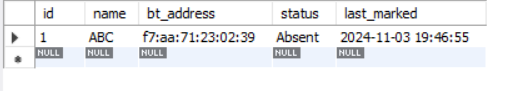
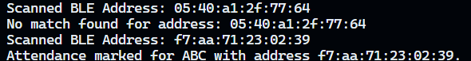
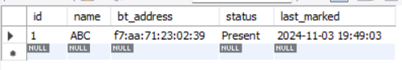

# BLE Attendance System

## Description

The **BLE Attendance System** project aims to automatically update attendance using Bluetooth Low Energy (BLE) technology. This is my first prototype, and it utilizes an ESP32 microcontroller that acts as a BLE beacon, scanning for nearby devices.

## Features
- **BLE Beacon:** The ESP32 scans for nearby Bluetooth devices and captures their addresses.
- **Local Database:** Bluetooth addresses are stored in a local MySQL database for comparison.
- **Real-Time Attendance Update:** The Python script processes the scanned addresses, compares them to the stored addresses, and updates attendance status in the database.
- **Simple Workflow:** After running the ESP32 code, the user can close the Arduino IDE and run the Python code to start updating attendance.

## Components Used
- **ESP32 DevKit V1** - Microcontroller for BLE scanning.
- **MySQL Database** - Local database for storing Bluetooth addresses.
- **Python** - For processing BLE data and updating attendance in the database.

## On my personal PC and using a wearable bluetooth smartwatch as the bt device for capturing attendance
---

ABC's smartwatch's bluetooth address is stored in the attendance and as the person ABC wearing the smartwatch is not in the range of the esp32 that can be considered as his class. so his attendance remains absent. 
---

The program scans the bluetooth devices and upon finding the match of ABC's device as ABC enters the range meaning the class his attendance is marked in the database.
---

ABC's attendance status has been changed from absent to present by the automation program.
