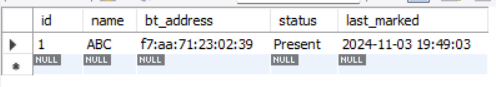

# BLE Attendance System

## Description

The **BLE Attendance System** project aims to automatically update attendance using Bluetooth Low Energy (BLE) technology. This is my first prototype, and it utilizes an ESP32 microcontroller that acts as a BLE beacon, scanning for nearby devices.

## Features
- **BLE Beacon:** The ESP32 scans for nearby Bluetooth devices and captures their addresses.
- **Local Database:** Bluetooth addresses are stored in a local MySQL database for comparison.
- **Real-Time Attendance Update:** The Python script processes the scanned addresses, compares them to the stored addresses, and updates attendance status in the database.
- **Simple Workflow:** After running the ESP32 code, the user can close the Arduino IDE and run the Python code to start updating attendance.

## Components Used
- **ESP32 DevKit V1** - Microcontroller for BLE scanning.
- **MySQL Database** - Local database for storing Bluetooth addresses.
- **Python** - For processing BLE data and updating attendance in the database.

# Project Title

## Project Overview
The project aims to automatically update attendance using BLE technology. Currently, it is my first prototype. Here I am using an ESP32 that acts as the BLE beacon scanning devices. I have noted down the Bluetooth address of my device (smartwatch) and put it in my local database. The scans are sent to the Python code that compares the scanned addresses to the Bluetooth address stored and updates the status. 

After running the ESP32 code in the Arduino IDE and uploading it to the device, it should be closed, and then the Python code should be run to check the SQL database to verify the attendance.

## Attendance Tracking Example

On my personal PC and using a wearable Bluetooth smartwatch as the Bluetooth device for capturing attendance, the process works as follows:

1. **Attendance Not Marked**: 
   - ABC's smartwatch's Bluetooth address is stored in the attendance database. 
   - As the person ABC is not in the range of the ESP32, his attendance remains marked as absent.

2. **Program Output**:
   - The program scans the Bluetooth devices, and upon finding a match for ABC's device as he enters the range (meaning the class), his attendance is marked in the database.

---

 *ABC's attendance is not marked as he is out of range.*

---

 *The program scans for Bluetooth devices in the vicinity.*

---

 *ABC's attendance status has been changed from absent to present by the automation program.*

---
